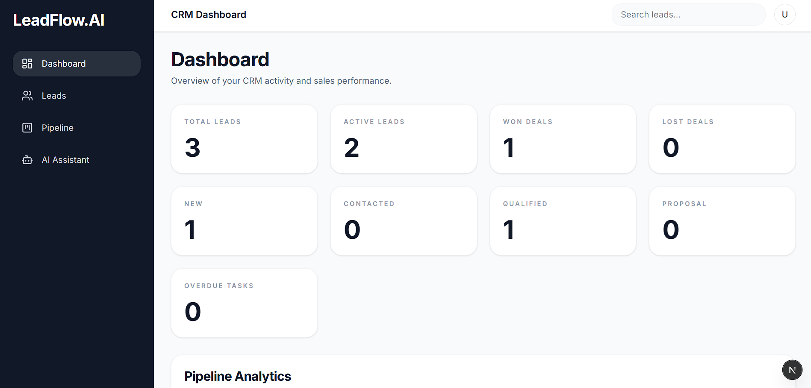
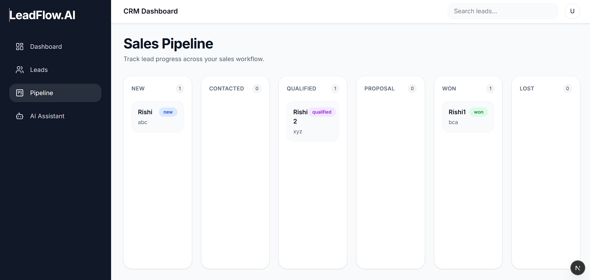
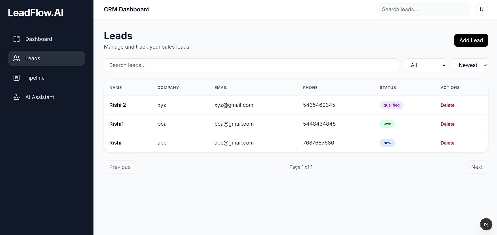

# LeadFlow.AI

AI-powered CRM SaaS platform built with Next.js, TypeScript, Express.js, PostgreSQL, Prisma ORM, and Ollama-based local LLM integrations.

LeadFlow.AI helps sales teams manage leads, track pipeline stages, organize customer interactions, and generate AI-powered CRM insights using locally hosted language models.

---

# Features

- Authentication & Protected Routes
- Lead Management System
- Sales Pipeline (Kanban Board)
- AI Lead Summaries
- AI Follow-Up Suggestions
- AI CRM Assistant
- Notes & Task Management
- Global Lead Search
- Dashboard Analytics
- Responsive SaaS UI
- Toast Notifications
- Loading Skeletons
- Local LLM Integration using Ollama

---

# Tech Stack

## Frontend

- Next.js
- React.js
- TypeScript
- Tailwind CSS

## Backend

- Node.js
- Express.js
- Prisma ORM

## Database

- PostgreSQL

## AI

- Ollama
- TinyLlama / Mistral

---

# Architecture

```text
Frontend (Next.js)
        ↓
Backend API (Express.js)
        ↓
PostgreSQL Database
        ↓
Ollama Local LLM
```

## Screenshots

### Dashboard



### Sales Pipeline



### AI Assistant


### Leads Management



### Lead Details


---

# Local Setup

## Clone Repository

```bash
git clone <your-repo-url>
```

---

## Frontend Setup

```bash
cd client

npm install

npm run dev
```

---

## Backend Setup

```bash
cd server

npm install

npm run dev
```

---

## Environment Variables

Create `.env` files for frontend and backend.

Example backend `.env`:

```env
DATABASE_URL=your_database_url
JWT_SECRET=your_secret
```

---

## Run Ollama

Install Ollama:

https://ollama.com/

Pull model:

```bash
ollama pull tinyllama
```

Run model:

```bash
ollama run tinyllama
```

---

# Future Improvements

- Dark Mode
- Email Notifications
- Team Collaboration
- CRM Activity Timeline
- CSV Export
- Deployment Optimization

---

# Author

Rishi Srivastava
